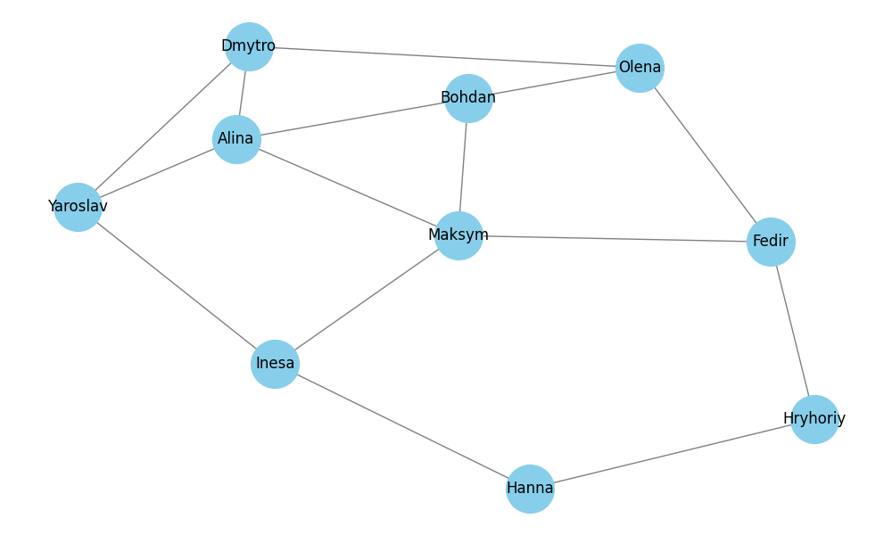
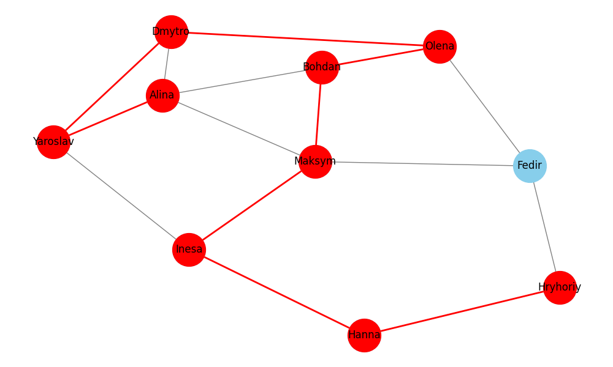
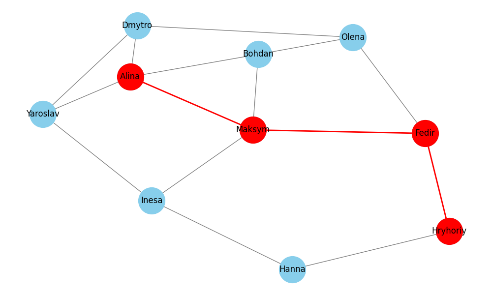

# Графи та алгоритми на графах

## Завдання 1: Створення та аналіз графа
У першому завданні створено модель соціальної мережі у вигляді графа, де:
- Вершини представляють користувачів (10 осіб)
- Ребра представляють зв'язки дружби між користувачами (15 зв'язків)

### Візуалізація соціальної мережі:

### Характеристики графа:
- Кількість вершин: 10
- Кількість ребер: 15
- Ступені вершин:
  - Alina: 4
  - Bohdan: 3
  - Maksym: 4
  - Dmytro: 3
  - Olena: 3
  - Fedir: 3
  - Hryhoriy: 2
  - Hanna: 2
  - Inesa: 3
  - Yaroslav: 3

### Розподіл ступенів вершин:
- Ступінь 4: 2 вершини
- Ступінь 3: 6 вершин
- Ступінь 2: 2 вершини

## Завдання 2: Пошук шляхів у графі
Реалізовано два алгоритми пошуку шляху між вершинами "Alina" та "Hryhoriy":

### Візуалізація шляхів:
#### DFS (Пошук у глибину):

#### BFS (Пошук у ширину):

### Порівняння алгоритмів:
- DFS знаходить шлях: ['Alina', 'Yaroslav', 'Dmytro', 'Olena', 'Bohdan', 'Maksym', 'Inesa', 'Hanna', 'Hryhoriy']
- BFS знаходить шлях: ['Alina', 'Maksym', 'Fedir', 'Hryhoriy']

### Аналіз різниці в шляхах:
1. DFS (Пошук у глибину):
   - Знайшов довший шлях (9 вершин)
   - Заглиблюється в одному напрямку до кінця перед тим, як спробувати інші шляхи
   - У нашому випадку пішов через більше проміжних вершин

2. BFS (Пошук у ширину):
   - Знайшов коротший шлях (4 вершини)
   - Досліджує всі можливі шляхи пошарово
   - Знайшов оптимальний шлях за кількістю переходів

## Завдання 3: Алгоритм Дейкстри
Реалізовано пошук найкоротших шляхів з урахуванням ваг ребер.

### Візуалізація графа з вагами:

### Результати для шляху Alina -> Hryhoriy:
- Найкоротший шлях: ['Alina', 'Maksym', 'Fedir', 'Hryhoriy']
- Довжина найкоротшого шляху: 7

### Цікаві спостереження:
1. Алгоритм Дейкстри знайшов той самий шлях, що й BFS, але з урахуванням ваг ребер
2. Хоча шлях містить таку ж кількість вершин, як і BFS, він є оптимальним за сумарною вагою
3. Інші можливі шляхи виявились довшими через більші ваги ребер

### Висновки:
1. BFS знаходить найкоротший шлях за кількістю переходів
2. DFS може знайти довший шлях, але робить це, використовуючи стратегію "вглиб"
3. Алгоритм Дейкстри знаходить оптимальний шлях з урахуванням ваг, що більш реалістично для практичних застосувань